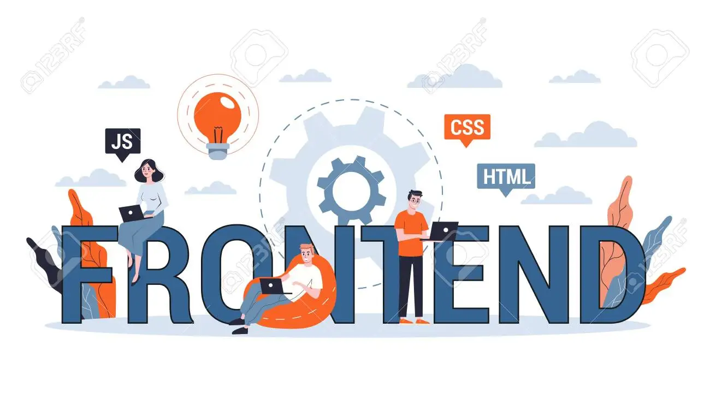

 
    
<h1 align="center">Hi 👋, I'm Premjeet</h1>
<h3 align="center">A passionate frontend developer</h3>

- 🔭 I’m currently working on **Live Project**

- 🌱 I’m currently learning **JQuery, Bootstap , Web development**

- 👯 I’m looking to collaborate on **Live project**

- 🤝 I’m looking for help with **Live project**

- 👨‍💻 All of my projects are available at [ab.github.io](ab.github.io)

- 📝 I regularly write articles on [abc.com](abc.com)

- 💬 Ask me about **HTML5 , CSS , JS**

- 📫 How to reach me **https://www.instagram.com/intothevoid_prem/**

- ⚡ Fun fact **My favourite animal is a dog because they're so energetic and friendly..**

<h3 align="left">Connect with me:</h3>

<h3 align="left">Languages and Tools:</h3>

      

&nbsp;

